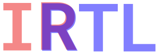

<p align="center"></p>

[](https://www.npmjs.org/package/irtl)
[](https://github.com/drom/irtl/actions/workflows/linux.yml)
[](https://github.com/drom/irtl/actions/workflows/macos.yml)
[](https://github.com/drom/irtl/actions/workflows/windows.yml)
[](https://coveralls.io/github/drom/irtl?branch=trunk)

IR for RTL in JavaScript

`irtl` is a small intermediate representation (IR) for register-transfer-level
(RTL) hardware, written in JavaScript. You describe modules — their ports,
wires, registers, and logic — as plain JavaScript, assemble them into a
hierarchy, and emit either [FIRRTL](https://github.com/chipsalliance/firrtl-spec)
or Verilog.

## Install

```bash
npm install irtl
```

```javascript
const irtl = require('irtl');
```

A pre-bundled standalone build (`build/irtl.js`, exposed as `irtl` via
[unpkg](https://unpkg.com/irtl)) is available for the browser.

## Quick start

Build a module, wrap it in a circuit, and emit both targets:

```javascript
const irtl = require('irtl');
const {input, output, wire, and, xor, or, buf, repeat} = irtl.elements;

const m = irtl.createModule('bar');

// ports
m.clk  = input.Clock();       // input  clk  : Clock
m.rst  = input(1);            // input  rst  : UInt<1>
m.arst = input.AsyncReset();  // input  arst : AsyncReset
m.inp1 = input(1);
m.inp2 = input(32);
m.out1 = output(11);

// wires and registers
m.tmp1 = wire(1);
m.tmp2 = {width: 8,  clock: m.clk};                              // register
m.tmp3 = {width: 16, clock: m.clk, reset: m.rst};               // sync reset
m.tmp4 = {width: 32, clock: m.clk, reset: m.arst, resetValue: 1}; // async reset

// literals and logic
m.lit1 = 5;                                   // width inferred
m.out1 = and(m.inp1, m.tmp1, m.tmp2, m.tmp2); // variadic
m.tmp8 = xor(m.tmp3, or(m.tmp4, m.lit1, 15));
m.tmp3 = buf(m.out1);
m.out2 = repeat(m.tmp1, 5);

// wrap the module(s) into a circuit hierarchy
const circuit = irtl.createCircuit('top_mod', [m]);

console.log(irtl.emitVerilog(circuit));
console.log(irtl.emitFirrtl(circuit));
```

Emitted Verilog:

```verilog
// circuit top_mod
module bar (
  input              clk,
  input              rst,
  input              arst,
  input              inp1,
  input       [31:0] inp2,
  output      [10:0] out1
);
wire               tmp1;
wire         [2:0] lit1;
wire               tmp8;
wire               out2;
reg          [7:0] tmp2;
reg         [15:0] tmp3;
reg         [31:0] tmp4;
assign lit1 = 3'd5;
assign out1 = (inp1 & tmp1 & tmp2 & tmp2);
assign tmp8 = (tmp3 ^ (tmp4 | lit1 | 4'd0));
always @(posedge clk or posedge rst) if (rst) tmp3 <= 16'd0; else tmp3 <= out1;
assign out2 = {5{tmp1}};
endmodule
```

Emitted FIRRTL:

```
circuit top_mod:
  module bar:
    input  clk: Clock
    input  rst: UInt<1>
    input  arst: AsyncReset
    input  inp1: UInt<1>
    input  inp2: UInt<32>
    output out1: UInt<11>
    wire   tmp1: UInt<1>
    wire   lit1: UInt<3>
    wire   tmp8: UInt
    wire   out2: UInt
    reg    tmp2: UInt<8>, clk
    reg    tmp3: UInt<16>, clk with: (reset => (rst, 0))
    reg    tmp4: UInt<32>, clk with: (reset => (arst, 1))
    lit1 <= UInt<3>(5)
    out1 <= and(inp1, and(tmp1, and(tmp2, tmp2)))
    tmp8 <= xor(tmp3, or(tmp4, or(lit1, UInt<4>(15))))
    tmp3 <= out1
    out2 <= cat(tmp1, cat(tmp1, cat(tmp1, cat(tmp1, tmp1))))
```

## Concepts

### Modules are Proxies

`createModule(name)` returns a `Proxy`. Assigning a property defines a signal;
reading a property returns a reference to that signal you can wire into logic.
The right-hand side of an assignment decides what the signal *is*:

| RHS | Result |
| --- | --- |
| `input(w)` / `output(w)` / `wire(w)` | a port or wire, optional bit width `w` |
| `input.Clock()` / `input.AsyncReset()` | a typed input port |
| `{width, clock}` | a register clocked by `clock` |
| `{width, clock, reset[, resetValue]}` | a register with reset (sync if `reset` is a plain input, async if the reset signal is `AsyncReset`) |
| a `number` | a literal; width is inferred as `ceil(log2(value + 1))` |
| an operation, e.g. `and(a, b)` | combinational logic driving the signal |

Referencing an undefined property (e.g. `m.foo` before assignment) lazily
creates an `Int` signal, so signals may be used before they are formally
declared.

### Builder API (explicit alternative)

`irtl.build(module)` wraps a module in an explicit, chainable, **validating**
facade over the same Proxy — both styles interoperate and emit identical RTL.
It is handy for generated code, and for tools (or LLMs) that prefer named
methods over Proxy assignment:

```javascript
const {add} = irtl.elements;

const m = irtl.build(irtl.createModule('adder'))
  .addInput('clk', {type: 'Clock'})
  .addInput('a', {width: 8})
  .addInput('b', {width: 8})
  .addOutput('sum', {width: 9})
  .addReg('acc', {width: 9, clock: 'clk'}); // clock by name or by signal

m.assign('sum', add(m.signal('a'), m.signal('b')));

// hierarchy without nested arrays:
const top = irtl.build(irtl.createModule('top')).instantiate(m);
const circuit = irtl.createCircuit('top', top); // accepts a builder or a tree
```

The facade validates as you go (`addInput('1bad')` and re-declaring a port both
throw actionable errors) and exposes introspection: `hasPort`, `getPortWidth`,
`getPortDirection`, `getSignalKind`, `listInputs`, `listOutputs`.

### Serialization

`irtl.serialize(circuit)` returns a plain, cycle-free JSON object (the live IR
is full of back-references and cannot be `JSON.stringify`-ed directly). Useful
for snapshots, diffing, or feeding the design to other tools:

```javascript
JSON.stringify(irtl.serialize(circuit), null, 2);
```

### Elements and operations

`irtl.elements` provides the signal constructors (`input`, `output`, `wire`)
and a set of variadic operation builders. Each operation returns a plain node
`{op, items: [...]}` that nests freely:

```
asUInt asSInt cvt neg not andr orr xorr
bits tail head pad
add sub mul div rem
lt leq gt geq eq neq
shl shr dshl dshr
and or xor cat
mux validif
assert assume cover
repeat buf
```

Variadic ops fold right: `and(a, b, c)` emits as `and(a, and(b, c))` in FIRRTL
and `(a & b & c)` in Verilog. `irtl.variadics` re-exports the binary/arithmetic
subset for convenience.

### Circuits, hierarchy, and plumbing

`createCircuit(name, tree)` assembles modules into an instance hierarchy. The
`tree` is a nested array where the first element is the parent module and the
rest are its children:

```javascript
// r ─ a ─┬─ b ─┬─ c
//        │     ├─ d ─ e
//        │     └─ f ─ h ─ i
//        └─ g
const [r, a, b, c, d, e, f, g, h, i] =
  'r a b c d e f g h i'.split(' ').map(irtl.createModule);

f.sig = 100;          // driven in f
e.foo = buf(f.sig);   // used in e — different subtree
g.bar = buf(f.sig);   // used in g — another subtree

const circuit = irtl.createCircuit('top_mod',
  [r, [a, [b, [c], [d, [e]], [f, [h, [i]]]], [g]]]);
```

When a signal is driven in one module and used in another, **plumbing**
([lib/plumb.js](lib/plumb.js)) automatically routes it through the hierarchy:
it finds the lowest common ancestor of the driver and each user, then inserts
the intermediate output/wire/input ports (named `_<path>_<sig>`) and instance
bindings needed to connect them. You write the intent; `irtl` generates the
port list.

## API

| Export | Description |
| --- | --- |
| `createModule(name)` | Create a module (a `Proxy`); assign properties to define signals. |
| `createCircuit(name, tree)` | Build the instance hierarchy and run plumbing; accepts a nested-array tree or a `build(...)` root. |
| `build(module)` | Wrap a module in the explicit, validating builder facade. |
| `serialize(circuit)` | Convert a circuit to plain, cycle-free JSON. |
| `elements` | Signal constructors (`input`, `output`, `wire`) and operation builders. |
| `variadics` | Arithmetic/logic operation builders (subset of `elements`). |
| `emitVerilog(circuit)` | Render the circuit to Verilog RTL (string). |
| `emitFirrtl(circuit)` | Render the circuit to FIRRTL (string). |
| `plumb(mods)` | Lower-level pass that inserts cross-module routing (run by `createCircuit`). |
| `identity` | `Symbol` used internally to unwrap a module Proxy to its target. |
| `version` | Package version. |

## Development

```bash
npm test        # eslint + node:test with coverage
npm run bundle  # esbuild standalone browser bundle -> build/irtl.js
```

Tests live in [test/](test/) and double as worked examples — [test/emit.js](test/emit.js)
covers a single feature-rich module, [test/hier.js](test/hier.js) covers
hierarchy and plumbing across several topologies, and [test/builder.js](test/builder.js)
exercises the builder facade, validation, and serialization.

## License

[MIT](LICENSE)
